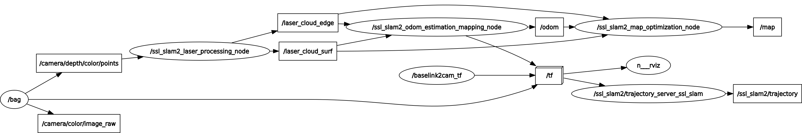

# ROS节点

* **ssl_slam2_laser_processing_node**: 
    * 订阅消息: /camera/depth/color/points
    * 发布消息：
        * /velodyne_points_filtered: 代码中未使用
        * /laser_cloud_edge：边缘特征
        * /laser_cloud_surf：平面特征
* **ssl_slam2_odom_estimation_mapping_node**: 
* **ssl_slam2_map_optimization_node**: 

